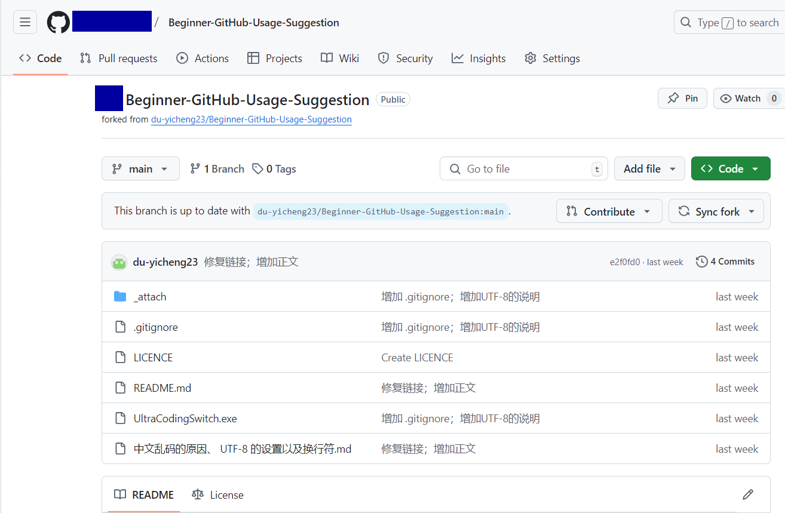
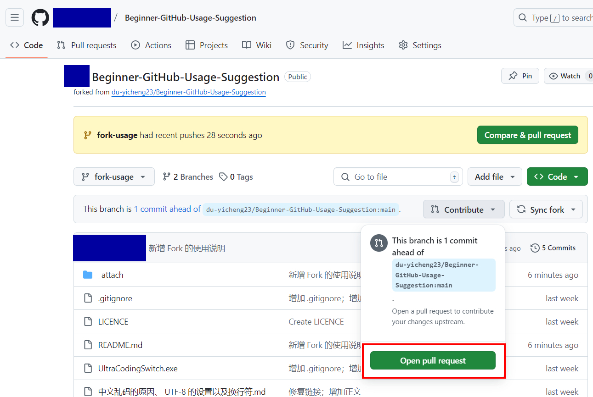

# Github 新手使用建议

1. 首先需要熟悉 `Git` 的使用。注意 `Git` 和 `Github` 是两个不同的概念。有关说明（包括 Git 的安装与使用方式）详见[文档](./Git与Github.md)。

2. 对于所有纯文本文件（包括源代码与文档），应当统一使用 `UTF-8(NO BOM)` 文件编码格式，换行符为 `LF`。有关文件编码格式与换行符的说明详见[文档](./中文乱码的原因、%20UTF-8%20的设置以及换行符.md)。

3. 注意缩进是否使用制表符（根据当前项目的规范文档决定，多数情况都是统一使用空格缩进）。使用空格缩进而不是制表符缩进的优势以及常见编辑器的设置详见[文档](./空格缩进与制表符缩进.md)。

4. `Issues` 板块一般只反馈仓库中的错误，或者程序的 bug。而对仓库中的疑问或者相关讨论应当在 `Discussions` 板块中讨论。不过由于 `Discussions` 板块默认是关闭的，需要管理员手动打开，因此部分仓库（尤其是比较老的仓库）没有开 `Discussions` 板块。在这种情况下，对仓库中的疑问或者相关讨论可以在 `Issues` 板块中进行。无论在哪个板块，在创建话题之前，都应当先搜索一遍是否存在类似的话题，如果没有，再另开话题。

5. 不要随意删除提交记录、`Issue` 或 `Discussions` 中的话题以及 `Pull requests` 中的记录。当讨论结束后关闭话题即可。

6. 除非你是仓库拥有者或内部开发成员，否则不应当直接把你的修改提交到仓库中。那么对于非仓库内部成员，应当如何贡献代码呢？答案是使用 `Fork` 功能 —— 点击仓库右上角的 `Fork` 按钮，将这个仓库“Fork”（动词）到自己的账号内，这样你自己的账号内就创建了一个新的仓库，如图 
 
可以看到，被 Fork 过来的仓库右上角多了两个选项。其中 `Sync Fork` 表示从主仓库拉取提交，也就是说如果原来的仓库发生了修改后，可以通过这个按钮将主仓库的更改拉取到自己账号下的这个 Fork 仓库中，从而实现与主仓库同步。同理，`Contribute` 按钮可以将自己账号下的 Fork 仓库提交的更改推送到主仓库中，这样就可以在不影响到主仓库的情况下贡献代码了。 
 
例如此处，在 Fork 仓库中创建了一个新的分支，然后再把更改提交到这个新分支内，这样就可以点击这个按钮创建一个 Pull Request, 从而请求主仓库的管理员将这个提交合并到主分支中。
