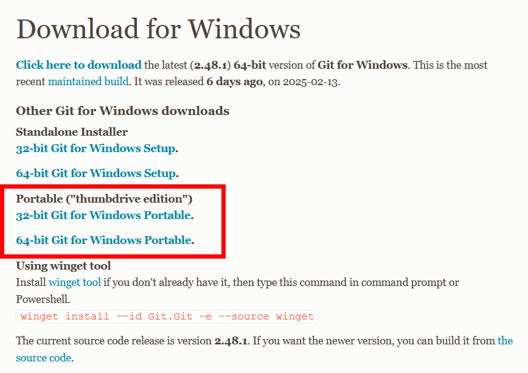

# Git 与 Github

`Git`: 版本控制工具<br>
`Github`: 代码托管平台

比如写一篇文章，多数情况下，我们会把重要的版本保存一份，这样下次改动的时候就可以放心大胆地改，不用担心改坏后原来的版本也丢失了的情况。对于一篇文章，我们在保存版本的时候会考虑复制一份，然后重命名为“xxx第一版”、“xxx第二版”，等等。这样的方式对于单个文章来说还能接受，但如果是大量文章，或者大量代码，这样保存版本就很麻烦，还会占用硬盘空间。因此诞生了如 `Git`、`SVN` 等**版本控制工具**。这些版本控制工具不需要备份文件，而是通过跟踪并记录文件的变化，从而实现记录版本。

也正是这样的特性，导致这些版本控制工具只适合管理**纯文本文件**的迭代（如果一个文件拿记事本打开不乱码，那它大概率是纯文本文件）。如果是非纯文本文件，那么很遗憾，不适合使用这些版本控制工具。强行使用也不是不行，但会导致工具运行速度减慢。

而 `Github` 实际上就是一个结合了 `Git` 的版本控制模式的“云盘”，这样结合了版本控制工具的模式的“云盘”就叫做“代码托管平台”。~~说白了，Github 就是一个高级一点的云盘（（~~

## Git 的安装

Linux 和 MacOS 下安装方式极其简单，参照[官网](https://git-scm.com/book/zh/v2/%E8%B5%B7%E6%AD%A5-%E5%AE%89%E8%A3%85-Git)上的说明即可。

Windows 下的安装稍微麻烦，需要进入[网站](https://git-scm.com/downloads/win)，然后下载 `Portable` 下面的（32-bit 与 64-bit 根据自己的电脑判断，32位的电脑下载 32-bit，64位的电脑下载 64-bit）<br>
<br>
然后将下载的压缩包解压到一个仅包含 ASCII 字符（只有英文、数字、`.` 符号、`_` 符号、`-` 符号）的路径下，将 `bin` 文件夹添加到 `Path` 环境变量下即可。<br>
也可以用 `winget` 下载，这需要先安装 `winget tool`，然后运行图中最下面的指令即可完成安装。

安装完成后，在终端输入以下命令以判断是否安装成功：
```Shell
git --version
```

## Git 的使用

参考教程：【【GeekHour】一小时Git教程】https://www.bilibili.com/video/BV1HM411377j/?share_source=copy_web&vd_source=fcf304aed18fe8b4e8f6da7f978b32c8<br>
先学习命令行下的使用，然后再使用图形界面。不要依赖图形界面，因为这个 Git 有时候命令行真的比图形界面更方便。以我目前的经验来看，多数图形界面都不太好用。我目前认为最好用的是 CLion 集成的可视化 Git，但它的标签功能仍然不好用。
