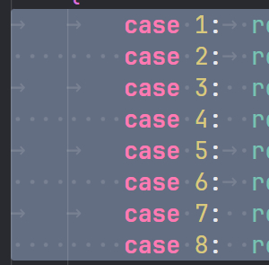
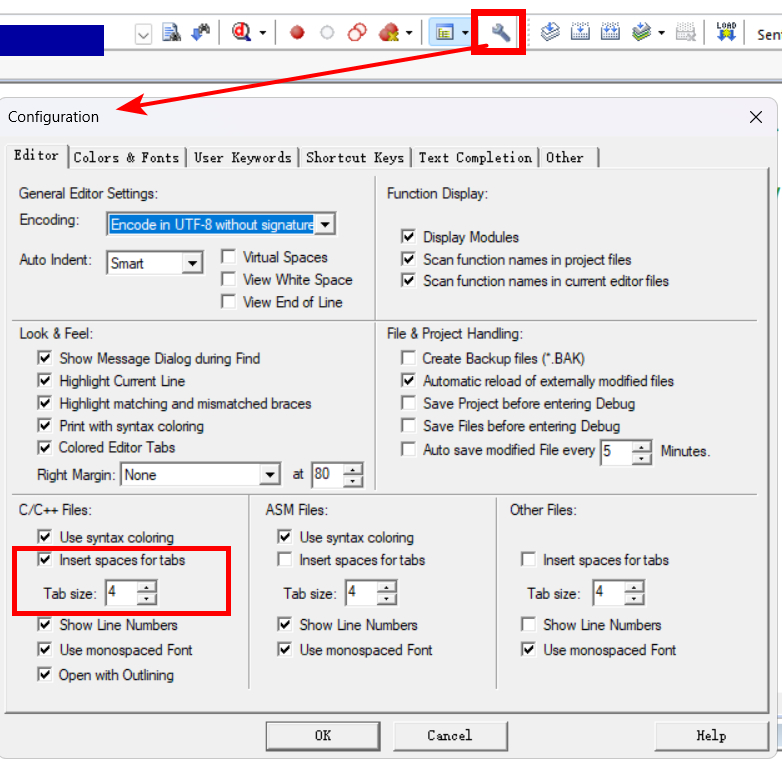
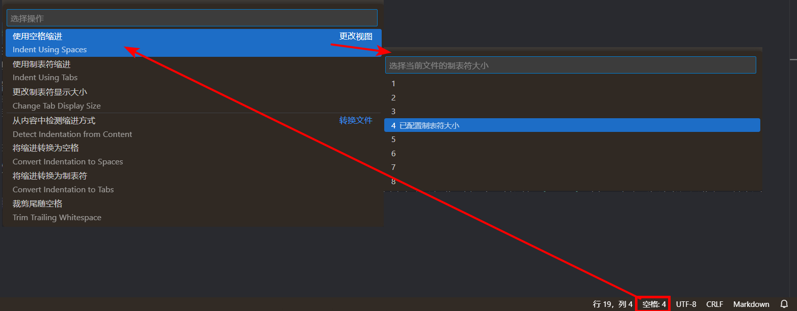
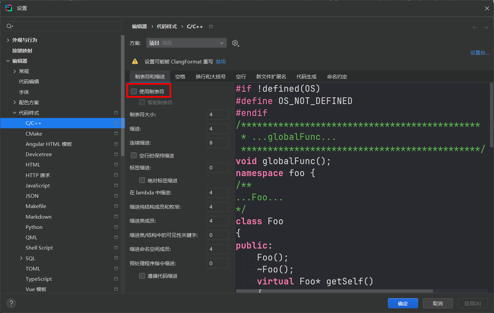

# 空格缩进与制表符缩进

## 使用空格缩进而不是制表符缩进的优势

一处混用了制表符缩进与空格缩进的代码如下图所示<br>
<br>
其中，`右箭头 → ` 符号表示一个制表符，`圆点 ·` 符号表示一个空格。在 case 左侧，制表符的宽度等于四个空格，但在冒号右侧，一个制表符宽度等于一个空格。由此，制表符缩进的劣势就体现出来了：不同地方的制表符的宽度可能不同，这样就很容易导致代码排版混乱。

当然，不采用制表符缩进不代表不能按 `Tab` 键，大部分编辑器进行了设置后，可以把按下 `Tab` 键由输出制表符改为输出数个设置好数量的空格。下面展示一些常用编辑器/工具如何设置空格缩进。

## 常用编辑器/工具设置空格缩进的方法

### Keil

如图：<br>
<br>
进入设置，在左下角的 `C/C++ Files` 选项里，勾选 `Insert spaces for tabs` 选项后，将采用空格缩进。下面的 `Tab size` 选项可以设置按下一个 `Tab` 键后缩进的空格数。

图中左下角红框内的配置仅针对 C/C++ 文件，右边的 `ASM Files` 对应配置汇编文件，再右边的则是其他文件的配置。这三个区域都有同样的选项，含义相同，此处不再赘述。

### VSCode

如图：<br>
<br>
点击右下角对应位置（显示的就是当前文件缩进的方式以及缩进的空格数），在弹出的菜单中选择 `使用空格缩进`，然后选择一个数字，选择的这个数字就是按下一个 `Tab` 键后缩进的空格数。

VSCode 的配置仅针对当前打开的文件。对于新打开的文件，它会自行判断当前文件的缩进规则。因此每打开一个文件，都得注意右下角显示的缩进规则，然后视情况进行修改。当然，可以使用诸如 clang-format 等工具自动整理。

### JetBrains IDE

以 CLion 为例，如图：<br>
<br>
左侧选择语言，然后取消勾选 `使用制表符` 选项即可设置为空格缩进。

### Clang-format

将 `.clang-format` 文件增加以下选项或把对应选项按如下的方式修改：

```YAML
UseTab: Never   # 不使用制表符缩进

IndentWidth: 4  # 整理的代码统一缩进 4 个空格

TabWidth: 4     # 按下一个 Tab 键缩进 4 个空格
```
