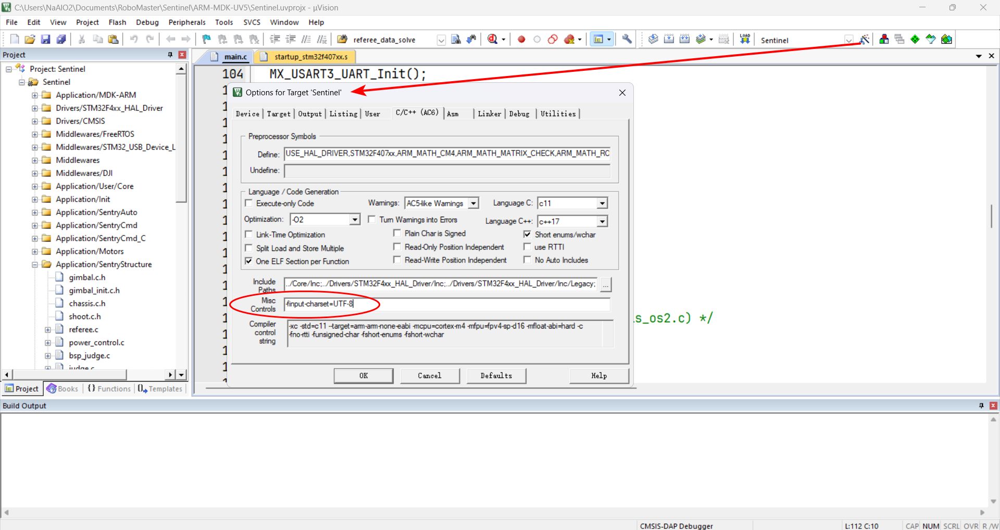

# 中文乱码的原因、 UTF-8 的设置以及换行符

## 产生乱码的原因
大多数情况下，在代码内的中文注释乱码的原因可参照下表[^1]：

<h3 align="center">Unicode 中文乱码速查表</h3>

| 乱码分类 | 示例                                  | 特点                          | 产生原因                                      |
|------|-------------------------------------|-----------------------------|-------------------------------------------|
| 古文码  | 鐢辨湀瑕佸ソ濂藉涔犲ぉ澶╁悜涓?                    | 大都为不认识的古文，并加杂日韩文            | 以 GBK 方式读取 UTF-8 编码的中文                    |
| 口字码  | ����Ҫ�¨2�ѧϰ������                   | 大部分字符为小方块                   | 以 UTF-8 的方式读取 GBK 编码的中文                   |
| 符号码  | 由月è\|å￥½å￥½å-\|ä1 天天向上 | 大部分字符为各种符号                  | 以 ISO8859-1 方式读取 UTF-8 编码的中文              |
| 拼音码  | óéÔÂòaoÃoÃѧϰììììÏòéÏ              | 大部分字符为头顶带有各种类似声调符号的字母       | 以 ISO8859-1 方式读取 GBK 编码的中文                |
| 问句码  | 由月要好好学习天天向??                        | 字符串长度为偶数时正确，长度为奇数时最后的字符变为问号 | 以 GBK 方式读取 UTF-8 编码的中文，然后又用 UTF-8 的格式再次读取 |
| 锟拷码  | 锟斤拷锟斤拷要锟矫猴拷学习锟斤拷锟斤拷锟斤拷              | 全中文字符，且大部分字符为“锟斤拷”这几个字符     | 以 UTF-8 方式读取 GBK 编码的中文，然后又用 GBK 的格式再次读取   |
| 烫烫烫  | 烫烫烫烫烫烫烫烫烫烫烫烫烫烫烫烫烫烫                  | 字符显示为“烫烫烫”这几个字符             | Visual Studio Debug 模式下，栈内存未初始化           |
| 屯屯屯  | 屯屯屯屯屯屯屯屯屯屯屯屯屯屯屯屯屯屯                  | 字符显示为“屯屯屯”这几个字符             | Visual Studio Debug 模式下，堆内存未初始化           |

因此 **如果当你打开文件后，发现已经存在乱码，一定不要修改（尤其是在打开了自动保存功能的编辑器上）或保存文件！** 否则将使文件的乱码永久保存，难以修复。

## 避免乱码的方式
要想避免乱码，就需要统一文件编码格式。对于 Keil 的设置，可以参考[江协科技的教程](https://jiangxiekeji.com/problem/px-1.html)（如果链接无法访问，[点这里查看镜像](./_attach/jiangxie-messy_code_solution/问题详情.htm)）。
文中提到的文件编码格式转换工具也可在仓库里下载（`UltraCodingSwitch.exe`）。

## UTF-8 与 UTF-8(With BOM) 的区别
> UTF-8是一种广泛使用的字符编码，它以其可变长度和兼容性而著称。UTF-8可以编码几乎所有的Unicode字符，并且可以兼容ASCII字符集，
> 这使得它成为一种非常流行的编码格式。
> 
> UTF-8 BOM（Byte Order Mark）是一个特殊的字符序列，它被用来标识UTF-8编码的文本文件。BOM的作用是告诉应用程序，
> 该文本文件使用UTF-8编码，以便应用程序能够正确地解析和显示文本内容。

由于某些原因，UTF-8 BOM 在 Windows 操作系统上比较容易出现，但 UTF-8 BOM 在一些场景下可能会引起解析问题，
特别是在处理器或解析器不支持 BOM 的情况下。<br>
为了统一规范，以及方便地使用 Git, **我们应当统一使用 UTF-8, 而不是 UTF-8 BOM**。UTF-8 对应在 Keil
的设置里就是 `UTF-8 without signature`，其余编辑器同理。亦即，在转换编码的时候也需要注意这个问题。

### 使用 Keil 的额外注意事项
对于 Keil 而言，如果需要使用串口打印 UTF-8 字符，还需要在 `Options fot target -> C/C++ 选项卡 -> Misc Controls`
增加参数 `--no-multibyte-chars`（对于 AC5 编译器而言），如图：


如果使用的是 AC6 编译器，增加的参数改为 `-finput-charset=UTF-8`，如图：


## CRLF 与 LF 的区别
> LF（Line Feed）代表“换行”，但你可能更熟悉术语换行符（转义序列 `\n`）。简单地说，这个字符代表一行文本的结束。
> 在 Linux 和 Mac 上，这相当于新文本行的开始。这种区别很重要，因为 Windows 不遵循此约定。我们了解回车之后再讨论为什么不同。
>
> CR（Carriage Return）代表回车（转义序列 `\r`），将光标移动到当前行的开头。终端上的下载进度条就是通过CR实现的，
> 通过使用回车符，你的终端可以通过将光标返回到当前行的开头并覆盖任何先前呈现的文本来将文本动画化。
> 
> ### 打字机和回车（CR）
> 将一张纸固定在称为托架的机械卷上，为设备送入一张纸。每次击键时，打字机都会使用墨水在您的纸张上打印字母，
> 将笔架向左移动以确保键入的下一个字母会出现在前一个字母的右侧。
> 
> 当然，一旦当前行的空间用完，打字员就需要向下移动到纸张上的下一行。这是通过旋转滑架将纸张相对于打字机的“笔”向上移动一定距离来完成的。
> 但是还需要重置托架（carriage）， 以便键入的下一个字符将与纸张的左侧边距对齐。换句话说，
> 打字员需要某种方式将托架返回到其起始位置。而这正是回车的工作：一个金属杆连接到托架的左侧，当推动时，将托架返回到其起始位置。
> 
> ### 电传打字机和回车换行（CRLF）
> 进入 20 世纪初，出现了电传打字机。基本上，它的工作方式与手动打字机相同，除了不是打印到物理纸上，
> 而是通过传输器通过物理电线或无线电波将消息发送给接收方。
> 
> 虽然打印方式不同，但是同样需要使用换行符 (LF) 和回车符 (CR)，而且这些设备需要同时使用换行符 (LF) 和回车符 (CR)
> 以允许打字员从下一行文本的开头输入。毕竟手动打字机就是这样工作的，只是它没有任何“字符”的概念，因为它是一种机械操作的设备。
> 
> 我们可以将 LF 和 CR 视为代表水平或垂直方向上的独立运动，而不是同时代表两者，这样更容易将其形象化。为了实现这个功能，
> 电传打字机在一些最早的操作系统中设定了 CRLF 行尾的标准，比如流行的 MS-DOS。将 CR 代表“回车” —— CR 控制字符
> 
> 将打印头（“回车”）返回到第 0 列，而无需推进纸张。 LF 代表“换行” —— LF 控制字符在不移动打印头的情况下将纸张前进一行。
> 因此，如果您想将打印头返回到第 0 列（准备打印下一行）并推进纸张（以便在新纸上打印），则需要 CR 和 LF。
> 
> MS-DOS 使用 CRLF 的两个字符组合来表示文件中的行尾，现代 Windows 计算机一直使用 CRLF 作为行尾。同时，从一开始，
> Unix 就使用 LF 来表示行尾，为了一致性和简单性而放弃了 CRLF。 Apple 最初仅在 Mac Classic 上使用 CR，但最终在 OS X
> 上改用了 LF，与 Unix 一致。
> 
> 虽然这似乎是操作系统之间的差异，但 CRLF 与 LF 的这个问题已经引起人们很长时间的头痛。其实按照今天的标准 CRLF
> 是多余的——同时使用回车和换行是假设你受到打字机的物理限制，你必须明确地向上移动你的纸，然后重置移动到左边距。
> 但是对于电子文件，将换行符定义为隐式完成换行和回车的工作就足够了。换句话说，只要操作系统定义换行符表示下一行从开头开始而不是从某个任意的列偏移处开始，
> 那么除了换行之外，我们不需要显式回车——一个符号可以完成两者的工作。
> 
> ### 在 Git 中配置行尾
> 可以使用 `core.autocrlf` 配置告诉git如何处理系统上的行尾。可以通过以下命令完成：
> ```
> git config --global core.autocrlf [true|false|input]
> ```
> 注意，`false` 值会关闭行尾转换，这通常是不可取的，除非是团队中的每个人都使用相同的操作系统。当然，我觉得这种情况很少发生，
> 所以慎用（除非你使用 .gitattributes 配置，在这种情况下，它会优先于你的 git 配置——稍后会详细介绍）。
> 
> 所以，一般来说我们只有两个选择：`autocrlf true` 和 `autocrlf input`。这两者有什么区别？
> 
> #### `autocrlf true` 选项
> 
> 当 `autocrlf` 为 `true 时`（git默认行为），文件将使用 git 在本地检出为 CRLF，但是每当你提交文件时，CRLF
> 的所有实例都将替换为 LF。基本上，此设置可确保你的代码库在所有文件的最终版本中始终使用 LF，但在获取时在本地使用 CRLF。
> 这是 Windows 开发人员的推荐设置，因为 CRLF 是 Windows 的本机行结尾。
> 
> 如果使用此选项，则每次在 Windows 上暂存文件以进行提交时可能会看到下面警告：
> ```
> warning: CRLF will be replaced by LF in <file-name>.
> The file will have its original line endings in your working directory.
> ```
> 这并不是说出现了问题， Git 只是警告你，根据此设置的预期行为，你的 CRLF 行结尾将在提交时规范化为 LF。
> 
> #### `autocrlf input` 选项
> 
> 使用 `autocrlf input`，文件在提交时转换为 LF，但在获取时不会转换为任何内容。因此名称为“输入”——你得到是你最初输入的内容。
> 如果一个文件最初被 Windows 开发人员意外提交为 CRLF，你会在本地看到它是 CRLF（如果你修改它，你会强制它变成LF）。
> 如果文件最初是作为 LF 添加的，您会看到它是LF。这通常是一件好事，因为这意味着你将始终在代码库中获得 LF
> 行结尾（假设你从一开始就使用它）。[^2]

因此，我们在使用 Git 时一般无需考虑这个问题，保持默认选项即可。

[^1]: https://github.com/justjavac/unicode-encoding-error-table/blob/main/README.md<br>
[^2]: https://zhuanlan.zhihu.com/p/380574688
